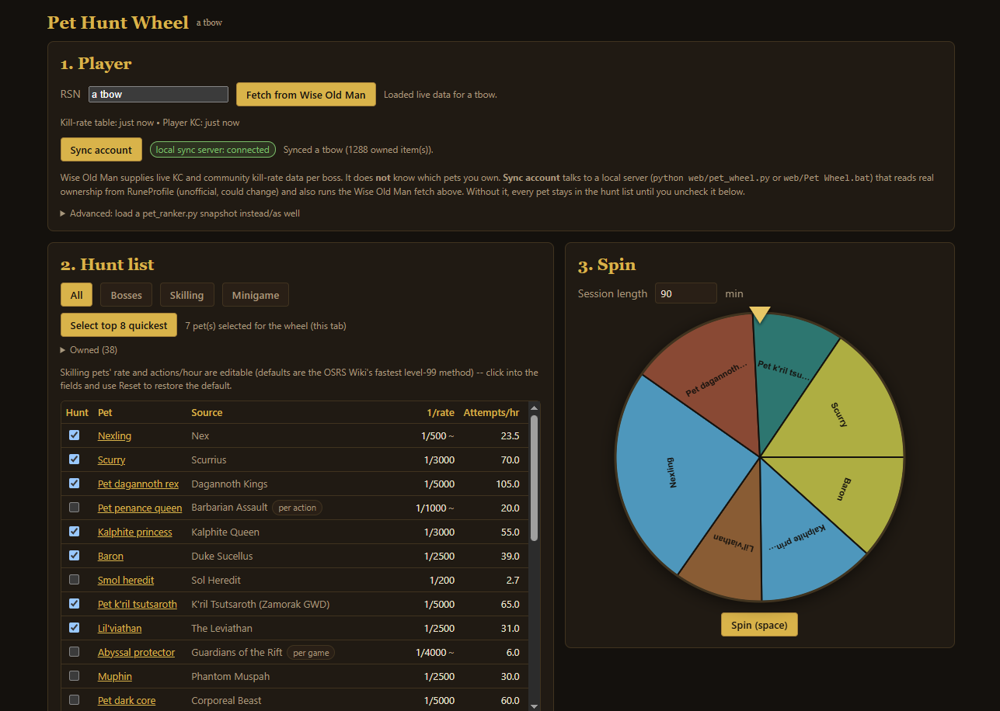

# OSRS Pet Wheel

A spin-the-wheel picker for deciding which Old School RuneScape pet to hunt next, weighted by how
long each one actually takes. It syncs your real boss KC and pet ownership so the wheel only ever
lands on something you don't have yet.



## Quick start

**Windows:** double-click `Pet Wheel.bat`.

**Any OS:**

```
python pet_wheel.py --rsn "your name"
```

Either one starts a local server, does one sync immediately, and opens
`http://127.0.0.1:8231/pet-wheel.html` in your browser with that account already loaded. Leave the
terminal window open while you use the page; `Ctrl+C` stops the server. Options: `--rsn NAME`
(account to sync), `--port N` (default `8231`), `--no-open` (skip auto-opening a browser tab).

### Without the server (file:// mode)

Double-click `pet-wheel.html` directly (or open it via File > Open) — it still works fully offline
with whatever data is cached in `localStorage` from a previous sync, but the page can't fetch
anything new until a local server is running (the "Sync account" button stays disabled with a
tooltip explaining why).

## What it fetches

- **[Wise Old Man](https://wiseoldman.net)** — boss KC, clue count, community-average kills/hour,
  and per-skill levels. Called directly from the page (its API sends CORS headers), so this works
  even in file:// mode with no server running. Each fetch keeps the previous kc snapshot around so
  the hunt table can show a "+43" delta next to kc that changed, and the sync status line reports the
  total kc gained since that previous fetch.
- **[RuneProfile](https://runeprofile.com)** (via the [RuneProfile RuneLite
  plugin](https://runelite.net/plugin-hub/show/runeprofile)) — your real collection-log pet
  ownership, so owned pets drop off the wheel automatically. This is an **unofficial**, community-run
  API with no CORS headers, which is why `pet_wheel.py`'s local server exists as a go-between; it
  could change shape or go away without notice.
- **OSRS hiscores fallback** — for the handful of activities Wise Old Man doesn't track under a
  matching boss metric (Guardians of the Rift, Wintertodt, Zalcano, Tempoross), run
  `python pet_ranker.py --rsn "your name" --json snapshot.json` and load that file from the page's
  "Advanced" section as a KC source.

## How the wheel weight and chunk work

Every pet has a rarity (1/N) and a time-per-attempt, so the wheel can compute "expected hours to
obtain." Pets with fewer expected hours remaining get proportionally more slices on the wheel — the
grind that's closest to paying off shows up more often. Before a session, pick a "chunk" length (in
minutes); the wheel does one weighted spin and tells you how many attempts of the chosen pet's
activity fit in that chunk, so you get a concrete task ("14 Zulrah kills") instead of an abstract pet
name. The **Feeling lucky** toggle beside the Spin button additionally biases the wheel toward
whichever hunted pets are furthest past their expected KC for a drop (rolls-so-far / rarity), without
changing any displayed chance, P(dry), or expected-hours figure.

- **Dry-o-meter** — the result card and hunt table's "Dry" column show expected rolls to date ÷
  rarity as a multiplier (1.0x = exactly at drop rate), colour-coded from "spooned territory" (green)
  through "on rate" to "dry"/"very dry" (red), plus the percentage of hunters who'd already have the
  pet at your kc.
- **Next milestone** — the result card also names the nearest upcoming target(s): hitting 1x/2x drop
  rate, and the next round-number kc milestone (100, 250, 500, 1,000, 2,000, 5,000, 10,000).
- **Sync nudge** — a hint above the wheel prompts a refresh when kc hasn't been synced in over 3 days
  (or was never synced), with a button that triggers the same Wise Old Man fetch as the button above
  the hunt table.

## Editable rates

Skilling pets (the pure skill-training pets, plus Herbi and Quetzin) have editable rate and
attempts/hour fields right in the hunt table — the OSRS Wiki gives a per-level-99 rate for one "best
method" per skill, but real playstyles vary, so click into the fields to enter your own and use
**Reset** to restore the wiki default. Each row's methodNote (hover the source cell) states which
method and wiki page the default came from, and flags whether the attempts/hour figure is
wiki-stated or an estimate.

## Hiding pets

Each hunt-list row has a **Hide** button (shown on hover) for pets you never want to see, such as
ones you don't intend to hunt. Hidden pets leave the list, the wheel, and "Select top 8 quickest".
They are listed under **Hidden (N)** above the table with an **Unhide** button each, plus **Unhide
all**. The hidden set is stored per RSN in `localStorage` and included in the Backup export.

## Privacy

Everything lives in your browser's `localStorage` for this page, namespaced per RSN so multiple
accounts don't overwrite each other's data. Nothing is uploaded anywhere except the Wise Old Man
requests above and, if you're running the local server, its `/api/sync` request (which in turn calls
RuneProfile and the OSRS hiscores on your behalf). `snapshot.latest.json` (gitignored) is a separate,
machine-local cache written by `pet_wheel.py` on every sync — not read by the browser, just there so
you can inspect the last raw sync result on disk.

Use the **Export/Import** buttons in the "Backup" panel to save or restore all of this as one JSON
file (for example, before clearing browser data).

## Regenerating the embedded pet dataset

`pet-wheel.html` embeds a merged pet dataset (rarity, attemptUnit, rollsPerAttempt, time estimate,
wiki link, methodNote, Wise Old Man metric) built from `data/pets.json` and `pet_ranker.py`'s `PETS`
tuple. `data/pets.json` is the same dataset the
[runelite-pet-hunter](https://github.com/alecray/runelite-pet-hunter) plugin ships. After editing
either source, regenerate it with:

```
python fetch_pet_icons.py   # only after adding a pet: downloads its wiki icon into data/icons/
python build_pet_data.py
```

A pet is included if EITHER source supplies a timing estimate: a `pet_ranker.py` PETS row (fixed-rate
boss kills and the hiscore-trackable roll/raid pets), or `data/pets.json`'s own `attemptUnit` +
`attemptsPerHour` fields (skilling pets and the fixed-rate minigame/clue pets). Two pets are excluded
from the wheel permanently regardless of any rate data — see "Known gaps" below.

### Keeping up with new pets

`check_pets.py` diffs `data/pets.json` against the wiki's `Category:Pets` and verifies every
`itemId` against the pet's infobox (a wrong ID means ownership sync never matches, so the pet never
leaves the hunt list). Run it locally with `python check_pets.py`; it exits 1 on drift. A GitHub
Action (`.github/workflows/check-pets.yml`) runs it every Monday and on PRs that touch the data, and
opens or updates a `pet-data` issue when something is missing. Pets that are deliberately not
huntable (cats, quest followers, Beaver metamorphs) are listed in `IGNORED_PAGES` in the script.

### Checking the spin loop

`spin_harness.js` runs one full spin of `pet-wheel.html` under Node with a stubbed DOM, Web Audio
and `requestAnimationFrame`, and exits 1 if the page script throws, the spin never calls
`onSpinComplete`, or the pointer flapper fails to settle. Run `node spin_harness.js` after touching
the spin, wheel drawing, flapper or sound code (`/spin-check` in Claude Code does the same). The
`check-pets` workflow runs it on every PR that touches `pet-wheel.html`.

## Known gaps

- **Broav and Cat are permanently excluded from the wheel** (`build_pet_data.py`'s `EXCLUDED_PETS`):
  both are one-time quest rewards (While Guthix Sleeps / Gertrude's Cat), not repeatable content, so
  "expected hours to obtain" doesn't apply.
- Live ownership comes from RuneProfile via `pet_wheel.py` and is **unofficial** — it could change
  shape or go away without notice. If `/api/sync` starts failing, the hunt list falls back to being
  managed by hand (uncheck owned pets yourself).
- Wise Old Man reports `ehb: 0` (no kill-rate) for Guardians of the Rift, Wintertodt, Zalcano, and
  Tempoross; those pets keep their hardcoded per-attempt time estimate.
- Chambers of Xeric Challenge Mode, Tombs of Amascut Expert Mode, and Theatre of Blood Hard Mode all
  have a materially better pet rate than normal mode, but weren't added as separate wheel rows — the
  OSRS Wiki excerpts checked didn't give a clean, distinct denominator for any of the three. The wheel
  uses each raid's normal-mode (best-case) rate for all three; see each pet's `methodNote` for the
  citation.
- Several skilling pets' `attemptsPerHour` default is a rough, explicitly-flagged estimate rather
  than a wiki-stated actions/hour figure (the wiki usually gives xp/hour, not actions/hour). Since all
  skilling-pet rates are user-editable in the hunt table anyway, this mainly affects the out-of-the-box
  default before you tune it to your own pace.
- `soul_wars_zeal` and Barbarian Assault have no usable WOM metric (zeal is a points total, not a
  game count, and WOM tracks no Barbarian Assault metric at all), so Lil' creator and Pet penance
  queen always use their hardcoded rate.

## Credits

- Rarity and rate data: the [OSRS Wiki](https://oldschool.runescape.wiki).
- Pet icons in `data/icons/`: item images from the OSRS Wiki, [CC BY-NC-SA 3.0](https://creativecommons.org/licenses/by-nc-sa/3.0/), fetched by `fetch_pet_icons.py`.
- KC, clue, and skill data: [Wise Old Man](https://wiseoldman.net).
- Pet ownership: [RuneProfile](https://runeprofile.com), via its RuneLite plugin.

## Related

This wheel started as part of [runelite-pet-hunter](https://github.com/alecray/runelite-pet-hunter),
a RuneLite plugin that tracks collection-log pet ownership in-client and suggests what to hunt next.
`data/pets.json` here is the same dataset that plugin ships.
